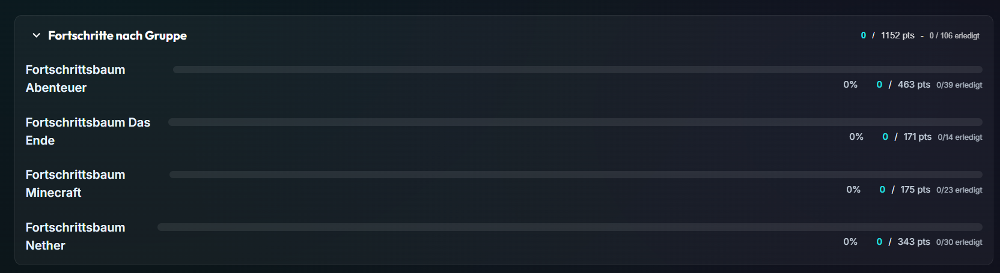

### Install

```bash
# Install the dependencies
$ npm i
```

### Dev

```bash
# Run the project on development mode
$ npm run dev
```

### Build

```bash
# Build a deployment for hosting
$ npm run build
```

## Usage

### Task Data

- Add the tasks in the task.json or finish the data fetching from a API endpoint
  - Default is the data usage from the json file

```js
import tasksData from '../tasks/tasks.json';
// import axios from 'axios'
const fetchTasks = async () => {
  // TODO: Fetch your Tasks from the database or API here
  // const res = await axios.get('api/tasks');

  // if (res.status !== 200) throw new Error('Error fetching tasks');
  // return res.data;

  // Temporary: use local JSON tasks
  return tasksData;
};
```

#### Example json object

```json
{
  "group": "Fortschrittsbaum Abenteuer", // Main group
  "title": "Eine unerwartete Entwicklung", // Title for the task element
  "description": "Verwandle einen Dorfbewohner zu einer Hexe", // Task description to display on the task element
  "points": 25, // Points for achievemnt
  "achievement": "32 Smaragde, 25 Erfahrungspunkte", // Achievement reward
  "finished": false, // Initial finish state for a task. After usage the states comes from the users localstorage
  "type": "Aufgaben-Fortschritte" // Task type for sub group creation
}
```

- Add groups or types as you want/need, the creation of groupings are dynamically
  

## App usage

### Progress Area

- Displays the current progress of all tasks and display the received points per player



### Searching / Grouping Area


#### Textbox

- Search for a word in the tasks: title, description, achievement, type or group

#### Filter Buttons

- Alle --> Show all tasks
- Offen --> Show all not finished tasks
- Erledigt --> Show all finished tasks
- Favoriten --> Show all tasks a user marked as favorite

#### Layout Buttons

- Change the task layout to grid
  
- or list
  

#### Collapse / Expand All

- Collapse or expand all groups (not sub groups)

#### Reset the App

- Reset all tasks and settings (layout and stuff) to default
- <b> THIS COULD NOT BE UNDONE </b>

### Groups / Sub Groups

- Drag and drop the groups and sub groups as you want
  

### Task

- Toggle finish state
- Toggle favorite state


<a style="font-size: 24px;" target='_blank' href='https://dlds-achievement-tacker.netlify.app/'> Try it out </a>
